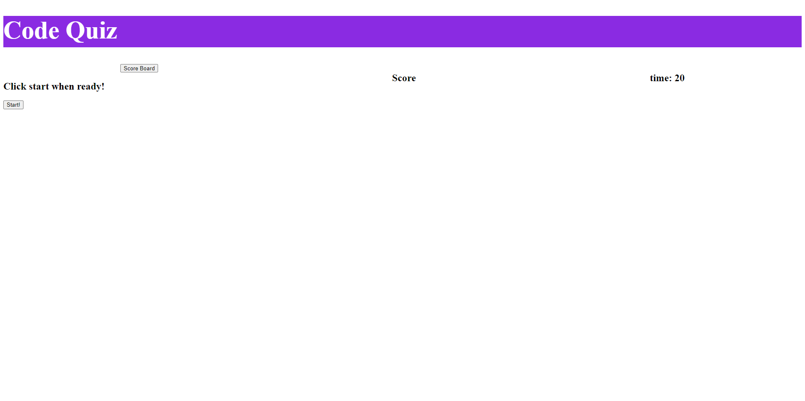

# weekFourChallenge_CodeQuiz

## Description

My motivation for making this project was to learn more about web APIs in JavaScript. I created this project to test my knowledge and to learn more on how web APIs and JavaScript interact. It solves the problem of helping me test my knowledge on JavaScript. I learned from making this project was how to make my webpages more interactive with the user using web APIs.

## Usage

    You can play the quiz by pressing the start button
    - for each answer you get right you get 10 points
    - for each answer wrong the timer goes down
    You can press the play again button or the add highscore button to add score
    You can also see your score with the highscore button

Link to webpage: (https://foundeven.github.io/weekFourChallenge_CodeQuiz/)
